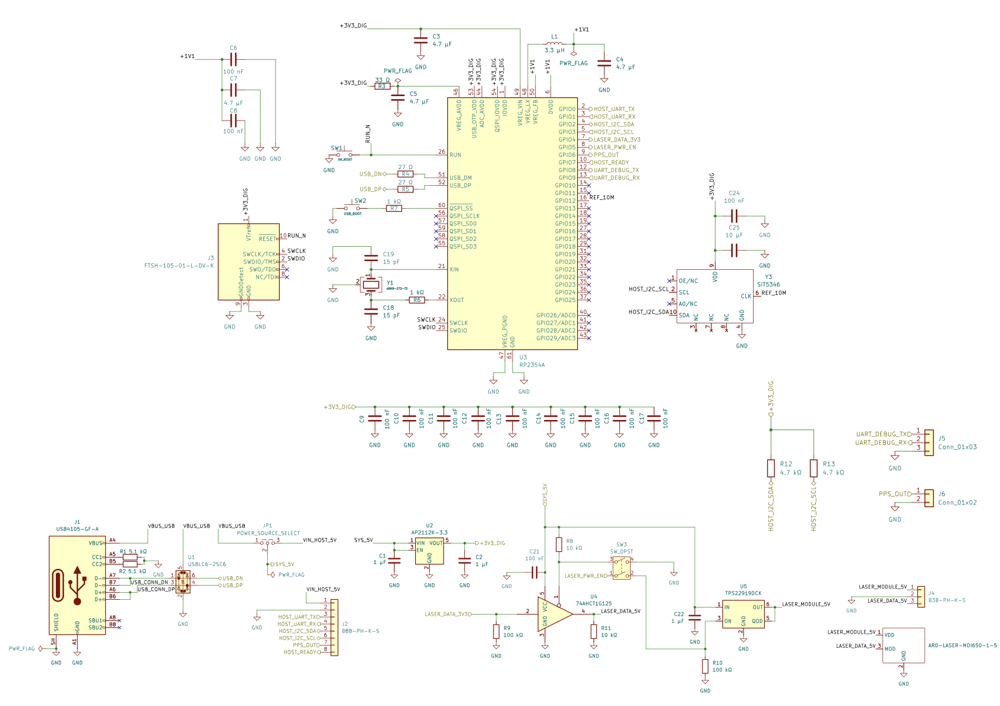
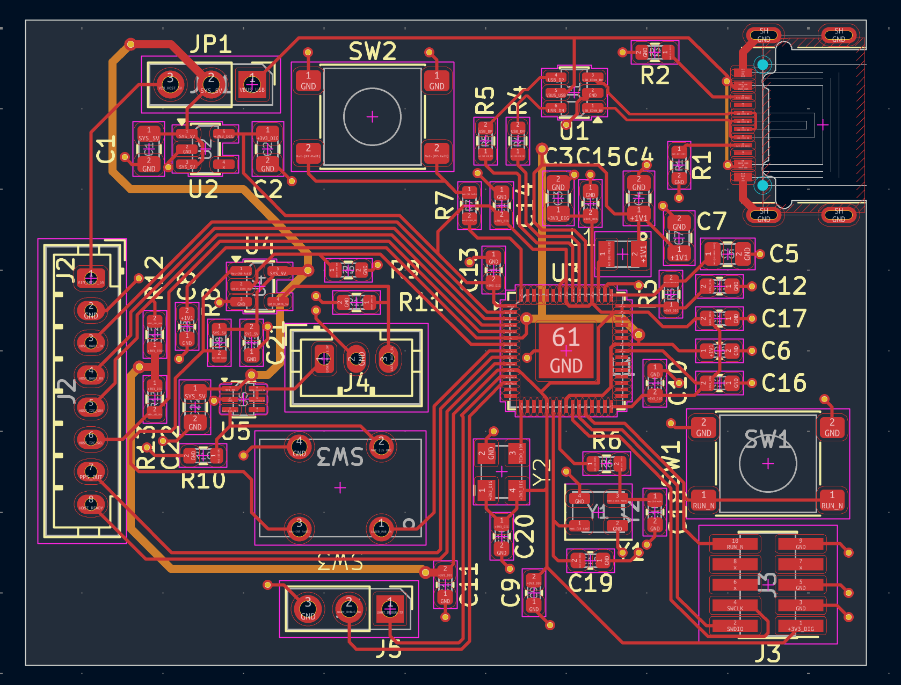
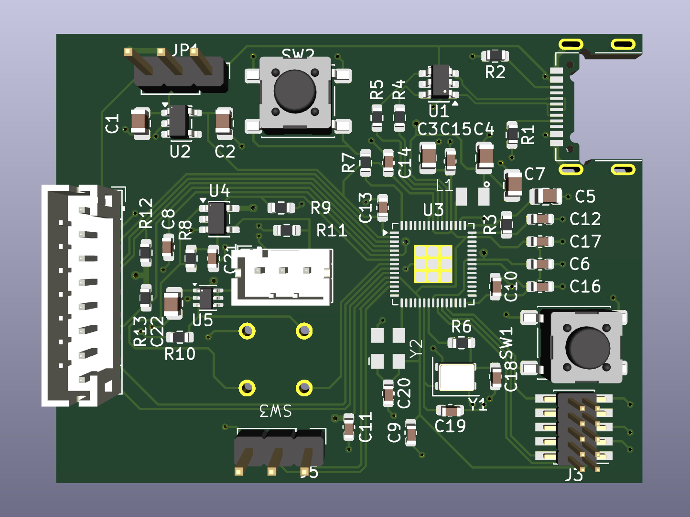
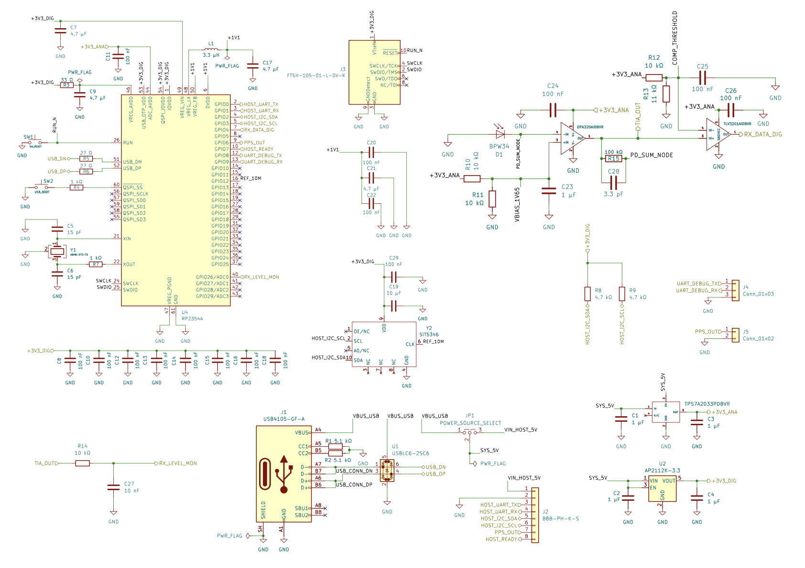
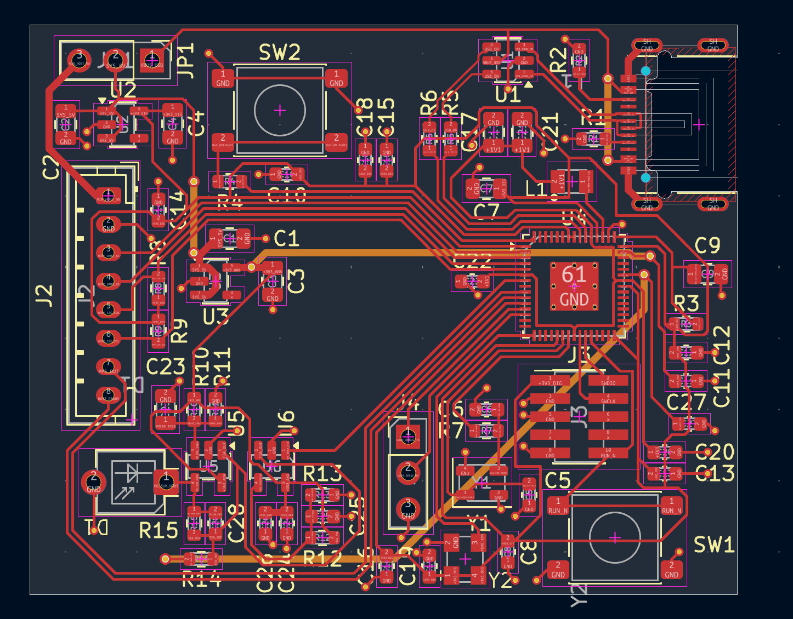
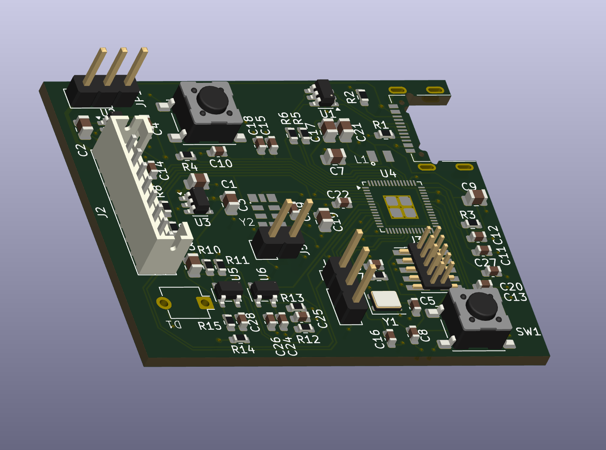

# A Free Space Optical Communication
This project implements a free-space optical communication link using two separate KiCad-designed boards: a transmitter and a receiver. The transmitter uses an RP2354A microcontroller to frame arbitrary digital payloads into packets and generate \(100 \mathrm{kbit/s}\) RZ-OOK modulation for a \(650 \mathrm{nm}\) laser module through a level-shifting buffer and an independent hardware safety chain.
The receiver uses a BPW34 photodiode, OPA320 transimpedance amplifier, and TLV3201 comparator to recover the optical pulses and feed them into an RP2354A for decoding, CRC verification, and delivery to the host system.
Both boards include USB-C, UART, SWD, a local \(12 \mathrm{MHz}\) crystal, and a \(10 \mathrm{MHz}\) SiTime SiT5346 DCTCXO reference. The SiT5346 is connected to the RP2354A through a GPIO/PIO clock input and is controllable over the existing I²C bus. Each board also exposes a dedicated $1\mathrm{PPS}$ output generated by the RP2354A. The initial target is a stable free-space optical link over approximately $5$ meters.

## Architecture
Two separate \(4\)-layer boards:
- TX: RP2354A + USB-C + host I/O + \(12 \mathrm{MHz}\) crystal + \(10 \mathrm{MHz}\) SiT5346 DCTCXO + dedicated \(1\mathrm{PPS}\) output + laser driver/safety chain + laser module.
- RX: RP2354A + USB-C + host I/O + \(12 \mathrm{MHz}\) crystal + \(10 \mathrm{MHz}\) SiT5346 DCTCXO + dedicated \(1\mathrm{PPS}\) output + BPW34 / OPA320 / TLV3201 optical receiver + ADC monitor.

### TX
- TX_ROOT
- TX_POWER_USB
- TX_MCU_CLOCK
- TX_HOST_IO
- TX_LASER

### RX
- RX_ROOT
- RX_POWER_USB
- RX_MCU_CLOCK
- RX_HOST_IO
- RX_OPTICAL_AFE
- RX_MONITOR

### TX schamtics:

### TX PCB: 

### RX schamtics:

### RX PCB: 

## Library:
### Pre-built Components Compatibility Verfication:

Verified: Symbol and Footprint compatibility: 

1. RP2354A  ✓
2. AP2112K-3.3  ✓
3. SN74AHCT1G125DBVR  ✓
4. TPS22919DCKR  ✓
5. USBLC6-2SC6  ✓
7. REF2033  ✓

### Costum Components:

1. SiT5346 ✓
2. OPA320  ✓
3. TLV3201 ✓
4. BPW34 (custom footprint)  ✓
5. TPS7A2033  (customed symbol) ✓
6. ABM8-272-T3_3225 (custom footprint)  ✓
7. AOTA-B201610S3R3-101-T (custom footprint) ✓
8. ES22MCBE (custom footprint) ✓
9. B3B-PH-K-S ✓
10. B8B-PH-K-S ✓
11. ARD-LASER-MDI650-1-5 ✓
12. FTSH-105-01-L-DV-K ✓
13. USB4105-GF-A ✓
